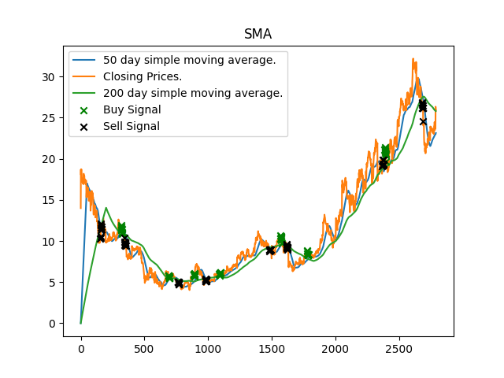
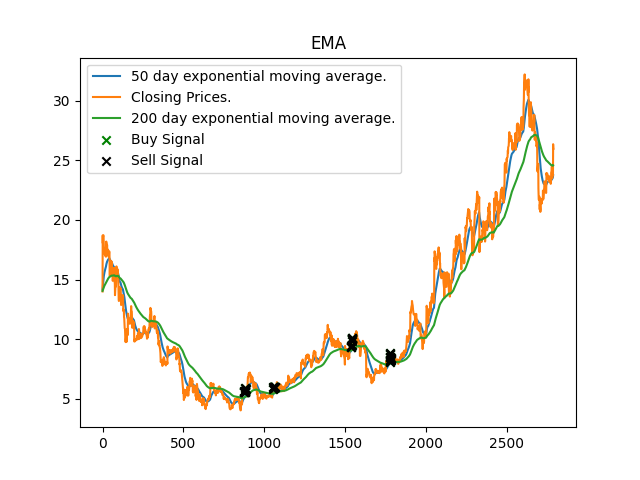
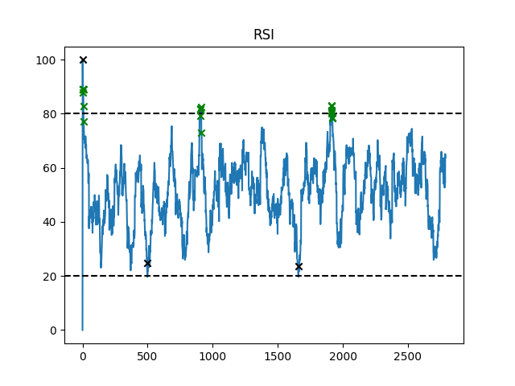
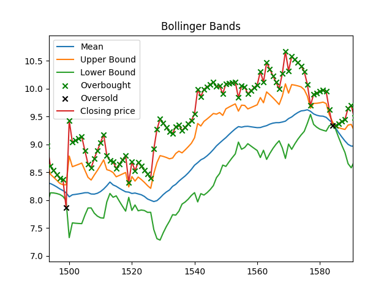
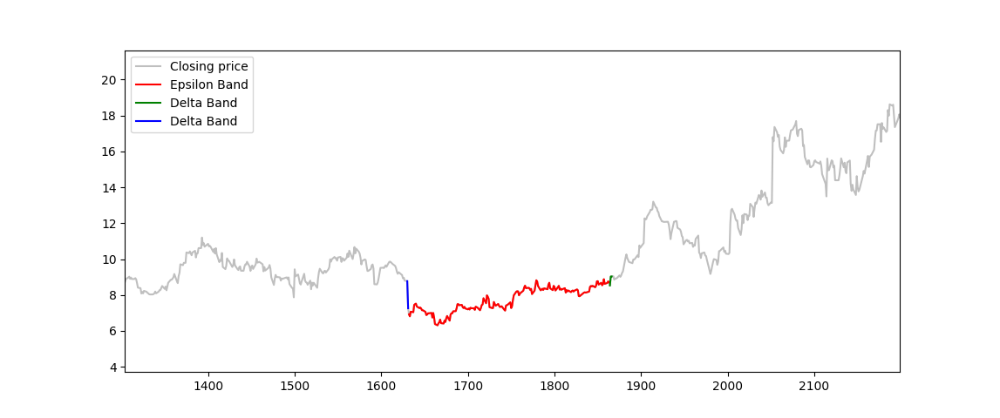

# prolog-technical-indicators

A collection of predicates defining the relation between elements in a time series and a common technical indicators.


### Indicators included
* Simple moving average
    * ```sma(++timing, ++atom, ++time, ++int, -list)```
  
* Exponential moving average
    * ```ema(++timing, ++atom, ++time, ++int, -list)```
    
* Relative Strength Index (RSI)
    * ```rsi(++timing, ++atom, ++time, ++int, -list)```
    
* Stochastic Oscillator
    * ```fast_k(++timing, ++atom, +time, ++int, -float)```
    * ```slow_k(++timing, ++atom, +time, ++int, ++int -float)```
    * ```slow_d(++timing, ++atom, +time, ++int, ++int, -float)```
    
* Bollinger Bands
    * ```bollinger_band(++timing, ++atom, +time, ++int, -float, -float, -float)```
    


They can be calulcated from a background knowledge of facts defined as:

```prolog
price(?index, ?ticker, ?date, ?open, ?high, ?low, ?close, ?volume).
```
Where it repsresents all the information about a trade at a single timepoint/day.

Each predicate is implemented to allow you to query them via a date or an index, allowing greater ease of use. For example.

```prolog
?- sma(date, aiy, "2014-01-12", 14, SMA), sma(idx, aiy, 200, 14, SMA).
SMA = 15.703809523809522.
```
The above example is querying the ticker ```aiy``` for the simple moving average at date ```"2014-01-12"``` (which is also indexed at 200).

### Identifying buy and sell signals.
Aside from the raw information this package includes predicates that hold only if a buy or sell signal is detected at that date/time.
They can be queried via date or index.

```prolog
% checking the 210th closing price if their is a buy signal crossover between 200 and 50 exponential moving averages.
?- xema(idx, aiy, 210, 200, 50, buy).
true .

% checking the 400th closing price if their is a buy signal crossover between 200 and 50 exponential moving averages.
?- xema(idx, aiy, 400, 200, 50, buy).
false.
```

All signals in a time series can be found:
```prolog
?- findall(I, (price(I,aiy,_,_,_,_,_,_), xema(idx, aiy, I, 200, 50, buy)), BuyDates).
BuyDates = [7, 203, 204, 205, 206, 207, 208, 209, 210|...].

?- findall(D, (price(_,aiy,D,_,_,_,_,_), xema(date, aiy, D, 200, 50, buy)), BuyDates).
BuyDates = ["2013-07-03", "2014-01-15", "2014-01-16", "2014-01-17", "2014-01-18", "2014-01-19", "2014-01-20", "2014-01-21", "2014-01-22"|...].
```

### Dates
If you wish to query the database for the indicators via a date the format is:```YYYY-MM-DD```.

## Epsilon and Delta Bands
Included in this repo are also predicates that define the relation between a point in time and the epsilon bands surrounding it. It also features a calculation for delta bands. These are used for identifying similar consecutive prices.
They are useful for identifying similar time points around a maxima or minima. 
### Epsilon-Bands
An epsilon band is a set of dates/timepoints that extends above and below a time. It contains all the points with similar close values.

### Delta-Bands
A delta band is the epsilon band extending forward and backward 
from the beginning and end of an epsilon band.
#### Example
An example of epsilon and delta bands applied on the minima of some time series can be seen below:


